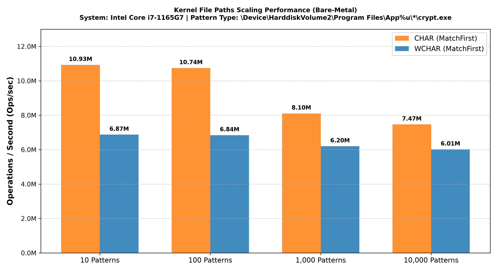
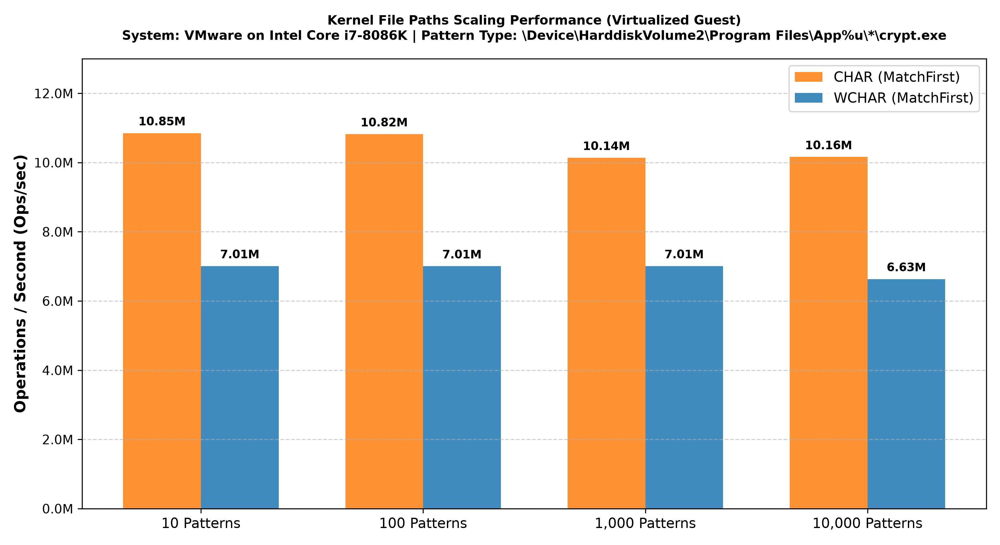
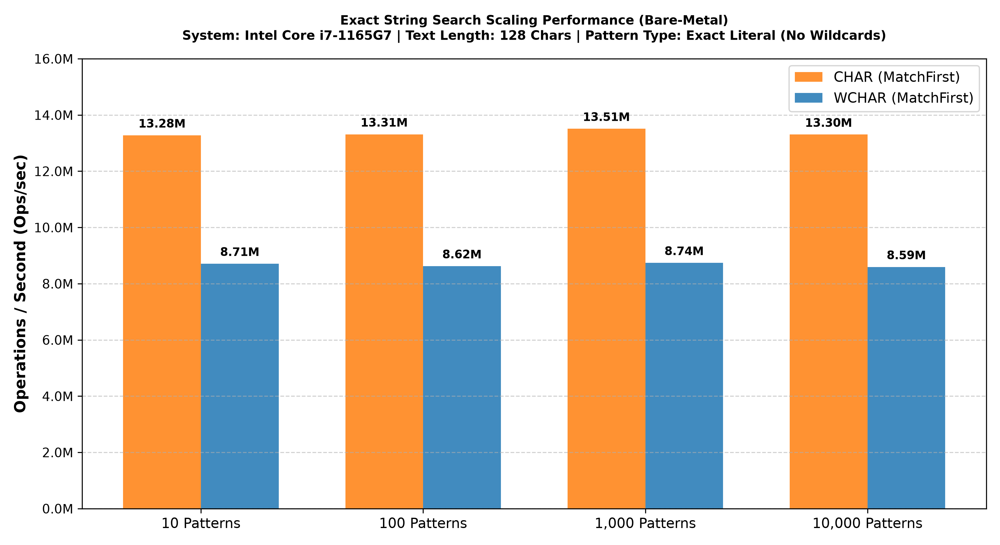
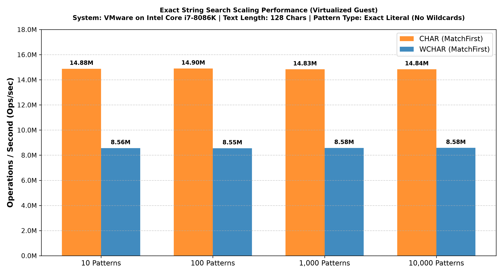

# High-Performance Windows Kernel String Pattern Match Engine

-blue)


## Table of Contents
1. [Overview](#overview)
2. [Architecture & Algorithms](#architecture--algorithms)
3. [Quick Start API Overview](#quick-start-api-overview)
   * [Pattern Syntax & Wildcard Scoping](#pattern-syntax--wildcard-scoping)
   * [Template Parameters](#template-parameters)
   * [Public API Methods](#public-api-methods)
   * [Example Implementation](#example-implementation)
4. [Benchmarks & Scaling Performance](#benchmarks--scaling-performance)
   * [Test Methodology & Benchmark Architecture](#test-methodology--benchmark-architecture)
   * [Performance Results](#performance-results)
5. [Project Layout](#project-layout)
6. [Building Instructions](#building-instructions)
7. [Conclusion](#conclusion)
8. [License](#license)

---

## Overview

`KmStringPatternMatch` is a highly optimized, non-blocking **multi-pattern** string matching engine intended for externally synchronized access, explicitly designed for high-speed Windows driver components, file system minifilters, and real-time security telemetry. Unlike native single-pattern kernel routines such as `FsRtlIsNameInExpression`—which are restricted to evaluating a target against one pattern at a time and force expensive sequential loops—this engine evaluates incoming target strings against a large pool of registered patterns simultaneously using a SwissTable-style hash map and a fast-path hash-existence filter.

To support precision file system filtering, the engine natively implements path segment scoping (`SCOPE_PATH_SEGMENT`), which stops wildcard expansion from crossing native directory separator boundaries (`\`). 

### Key Architectural Highlights
* **Multi-Pattern Concurrency & Early-Exit:** Indexes tens of thousands of rules concurrently, evaluating target text against the entire pattern set in a single pass while using fast-path rejections to instantly drop non-matching inputs.
* **Hardware Support:** Provides architecture-specific x64 and ARM64 implementations for the low-level hashing and bit-manipulation primitives.
* **Allocation-Free Matching Path:** After registration, the matcher performs no internal pool allocations during candidate evaluation. The caller-provided output vector for `Search(..., PatternContexts)` may still allocate as it grows.
* **Pattern Capacity Limit:** To prevent unbounded kernel memory exhaustion, the engine is constrained by a strict capacity limit of 131,072 registered patterns per instance.
* **Hash-Existence Filter Rejection:** Uses a 512-bit hash-existence filter to discard non-matching target strings before expensive character comparisons occur.
* **SWAR Literal Evaluation:** SIMD Within A Register (SWAR) techniques process up to 8 characters simultaneously via 64-bit operations.
* **Non-Recursive State Machine:** Windows kernel-mode execution has a tightly constrained stack (approximately three pages on supported configurations). This engine avoids recursive stack growth, keeping wildcard evaluation independent of input-driven recursion depth; callers requiring additional stack space can use the documented kernel stack-expansion mechanisms.
* **IRQL Compatibility:** May be used at `DISPATCH_LEVEL`, provided the matcher, pattern data, target buffer, and all other accessed memory are resident/nonpaged and the configured pool type is appropriate for that IRQL.
  * **Case-Sensitive:** Matching for both CHAR and WCHAR strings consists purely of raw memory comparisons and can execute at `DISPATCH_LEVEL` when all accessed memory is resident/nonpaged and the matcher is configured appropriately. 
  * **Case-Insensitive (`CHAR`):** Matching for 8-bit strings is strictly restricted to the ASCII range, bypassing OS locale dependencies and can execute at `DISPATCH_LEVEL` under the same residency and pool constraints.
  * **Case-Insensitive (`WCHAR`):** Unicode case-folding uses `RtlUpcaseUnicodeChar` and therefore must execute below `DISPATCH_LEVEL`.

---

## Architecture & Algorithms

### High-Level Design
The engine uses a two-phase architecture: registration-time preprocessing and search-time candidate evaluation to maximize CPU efficiency:
1. **Registration Phase:** When a pattern is added, the engine parses it into an exact *literal prefix* and a *wildcard suffix*. The literal prefix is case-folded (if configured), hashed, and mapped into a SwissTable-style hash map, while the user's context payload is stored in a segmented deque. The hash is then stamped into a 512-bit hash-existence filter. Note: `AddPattern()` and `Clear()` mutate the internal structures, while `Search()` reads them; callers must ensure proper external synchronization if modifying the engine concurrently.
2. **Search Phase:** As target text arrives, the engine calculates an incremental block hash. It checks the hash-existence filter first. If the corresponding bit is set, it probes the hash map to retrieve potential pattern candidates. For any candidates found, it performs an exact SWAR comparison on the literal prefix. If the prefix matches, it hands the remaining unparsed text over to the non-recursive wildcard state machine. If the wildcards match, the saved context payload is returned.

### 1. Custom WDK Container Ecosystem
Since the Windows Driver Kit (WDK) lacks appropriate C++ containers (such as `std::unordered_map` or `std::vector`), the engine relies entirely on a custom-built, kernel-safe container ecosystem optimized for minimal overhead:
* **`KStringArena`:** Carves character blocks from continuous backbuffer memory slabs. String lifespans are permanently locked to the arena, reducing per-string allocation overhead, alignment waste, and fragmentation associated with allocating individual strings.
* **`KFlatHashMap`:** An open-addressing hash table modeled after SwissTable architectures. It isolates an array of 1-byte metadata entries (`m_Ctrl`) from key-value pairs (`m_Slots`). Matching fetches 8 control bytes at once and utilizes bitwise SWAR operations to identify match indices.
* **`KDeque`:** A segmented array-based double-ended queue. It circumvents massive contiguous dynamic allocations by segmenting data into fixed-size chunks, bounded to a maximum of 256 dynamically tracked blocks. This imposes the engine's 131,072 maximum element limit, intentionally preventing unbounded memory exhaustion.
* **`KVector`:** A resizable contiguous array implementing Small Vector Optimization (SVO). It embeds a pre-sized inline byte buffer to handle collections of 2 or fewer elements locally, bypassing dynamic pool allocations for collections containing two or fewer elements.

### 2. WyHash-Style Block Hash & Hash-Existence Filter Rejection
Unlike rolling hash algorithms (e.g., Hornet or Rabin-Karp), the engine utilizes a scalar WyHash-style block hasher designed for high-speed batch processing. While vectorized AVX2/AVX512 implementations of Hornet can achieve higher raw throughput in user mode, executing AVX instructions in Windows kernel mode requires preserving extended processor state (`KeSaveExtendedProcessorState` / `KeRestoreExtendedProcessorState`). The CPU cycle cost of saving and restoring the extended vector register context substantially exceeds the execution time of the hash computation itself.

To eliminate this overhead, the engine intentionally relies on a scalar, GPR-only WyHash implementation. Profiling during development confirmed that scalar WyHash consistently outperforms scalar rolling Hornet implementations, executing entirely within 64-bit general-purpose registers without incurring floating-point or vector state save penalties.
* The text is loaded into 64-bit unaligned chunks and processed via a cross-platform 128-bit multiplication folder (`Mix64`).
* The architecture-specific implementations use hardware intrinsics (`_umul128` on x64, `__umulh` on ARM64) to perform the 128-bit multiplication/mixing operations.
* The resulting 64-bit hash feeds directly into a **512-bit hash-existence filter bitmap array** (`m_HashFilter`). This serves as a high-speed fast-path rejection mechanism, allowing the engine to discard incoming string targets that do not generate valid hashes for any registered pattern prefix.

### 3. Overlapping 64-bit SWAR Literal Evaluation
For literal pattern prefixes, the engine leverages SIMD Within A Register (SWAR) chunking rather than sequential character-by-character comparisons.
* The target text is loaded into 64-bit blocks using aliasing-safe unaligned loads.
* **Case-Insensitive Fast Path:** To support case-insensitivity without heavy branching, the engine performs a high-speed SWAR ASCII check (`IsAsciiSWAR`). If the 64-bit block is entirely ASCII, it applies an inline bitwise arithmetic transformation (`ToUpperSWAR`) to case-fold all 8 characters efficiently.

### 4. Non-Recursive Fast-Forward Wildcard State Machine
Traditional wildcard evaluators suffer from severe stack depth exhaustion and CPU pipeline stalling caused by deep recursive backtracking. 

To solve this, the engine utilizes a non-recursive wildcard state machine with fast-forward scanning that avoids recursive backtracking:
* **The Fast-Forward Cursor:** Rather than locking into character-by-character increments, the engine isolates the target literal character immediately following a wildcard operator (`*`). It then propels an unrolled linear cursor (`s += 4`) forward through the text memory, bypassing irrelevant segments without invoking state transitions.
* **Backtracking Jumps:** Upon encountering a mismatch in a subsequent literal sequence, the matcher restores the most recent wildcard state using `lastStarP` and `lastStarS`, without recursive stack frames.

---

## Quick Start API Overview

The `KmStringPatternMatch` class is highly customizable through its template arguments and provides a straightforward interface for adding patterns and executing searches.

### Pattern Syntax & Wildcard Scoping

The matching engine supports standard wildcard operators alongside path-aware boundary scoping and explicit character escaping:

#### 1. Supported Wildcard Operators
* **`*` (Zero or More Characters):** Matches any sequence of zero or more characters. The non-recursive state machine fast-forwards through text to locate subsequent literal sequences without recursive stack growth. Consecutive asterisks (e.g., `**`) are collapsed dynamically during evaluation within the search state machine.
* **`?` (Single Character):** Matches exactly one character. Each `?` operator is evaluated iteratively within the matching engine.

#### 2. Literal Escaping (`|`)
The engine reserves the pipe character (`|`) as an escape prefix to allow matching reserved syntax symbols as literal characters:
* **`|*`**: Matches a literal asterisk character (`*`) rather than acting as a wildcard.
* **`|?`**: Matches a literal question mark character (`?`) rather than acting as a single-character wildcard.
* **`||`**: Matches a literal pipe character (`|`).
* **Unrecognized Escapes:** When `|` is followed by any character other than `*`, `?`, or `|`, the engine treats both the pipe symbol `|` and the subsequent character as verbatim literals. Trailing or dangling escapes at the end of a pattern are handled safely without buffer overreads.

#### 3. Path Boundary Scoping (`WILD_CARD_SCOPE`)
When registering a pattern via `AddPattern()`, callers configure a scoping parameter to control whether wildcard expansion is allowed to cross directory separator boundaries (`\`):
* **`SCOPE_DEFAULT`:** Unrestricted wildcard matching. Wildcard operators (`*` and `?`) expand across any character, including directory separators (`\`). This is typically used for general string matching or rules that must traverse multiple subdirectory levels (e.g., `\Device\*\Confidential\*.dat`).
* **`SCOPE_PATH_SEGMENT`:** Confined path-segment matching. Wildcard operators (`*` and `?`) are explicitly blocked from crossing directory separators (`\`). This ensures evaluation is confined strictly within the current path component, preventing rules intended for a single directory (e.g., `\Device\...\Temp\*.tmp`) from matching deeper nested hierarchies.

### Template Parameters
`template <typename TContext, typename TChar = WCHAR, POOL_FLAGS PoolType = POOL_FLAG_NON_PAGED>`
* **`TContext`**: The user-defined context payload type returned upon successful matches. This can be a struct, an integer ID, or a pointer to an external object.
* **`TChar`**: The character type of the patterns and targets. Supports `WCHAR` and `CHAR`. Convenience aliases `KmStringPatternMatchW` and `KmStringPatternMatchA` are provided.
* **`PoolType`**: The NT kernel pool flags used for internal data structures. Defaults to `POOL_FLAG_NON_PAGED`.

### Public API Methods

```cpp
explicit KmStringPatternMatch(_In_ bool bCaseInsensitive = false) noexcept;
```
* Initializes the pattern matcher. If `bCaseInsensitive` is `true`, string matching evaluates without case sensitivity.

```cpp
NTSTATUS AddPattern(_In_reads_(cchPattern) const TChar* __restrict sPattern,
                    _In_                   UINT32                  cchPattern,
                    _In_                   WILD_CARD_SCOPE         WildScope,
                    _Inout_                TContext&&              PatternContext);
```
* Registers a pattern, parsing out literal prefixes and caching contexts in the internal memory arena.
* **`sPattern`**: Pointer to the character array defining the wildcard pattern.
* **`cchPattern`**: The length of the pattern in characters (excluding any trailing null terminator).
* **`WildScope`**: The boundary scope (`SCOPE_DEFAULT` allows free wildcard expansion; `SCOPE_PATH_SEGMENT` restricts expansion across `\` boundaries).
* **`PatternContext`**: The user-defined payload mapped to this specific pattern (passed via move semantics).

```cpp
bool Search(_In_reads_(cchText)       const TChar* __restrict sText,
            _In_                      UINT32                  cchText,
            _Outptr_result_maybenull_ TContext**              PatternContext) const noexcept;
```
* Searches for a matching pattern against the provided target text. Returns the first match encountered by the matcher's internal evaluation order. Registration order should not be relied upon.
* **`sText` / `cchText`**: The target text buffer and its character length.
* **`PatternContext`**: Out-pointer receiving the matched payload context on success.

```cpp
NTSTATUS Search(_In_reads_(cchText) const TChar* __restrict       sText,
                _In_                UINT32                        cchText,
                _Out_               KVector<TContext*, PoolType>& PatternContexts) const noexcept;
```
* Searches and collects **all** matching pattern contexts against the provided target text.
* **`PatternContexts`**: A `KVector` object receiving all payload contexts that successfully matched. (Note: While the search evaluation path avoids internal allocations, this caller vector may allocate memory if it grows beyond its Small Vector Optimization capacity).

```cpp
void Clear() noexcept;
```
* Flushes all patterns, hash buckets, and memory arenas, safely resetting the engine to empty and releasing pooled allocations.

### Example Implementation

```cpp
#include <ntddk.h>
#include "KmStringPatternMatch.h"

// 1. Define a custom payload to associate with patterns
struct RuleContext
{
    ULONG RuleId;
    ULONG AccessMask;
};

// Main execution routine
NTSTATUS RunPatternMatchExample()
{
    // 2. Initialize the Engine
    // WCHAR engine, case-insensitive (true), using NonPagedPool
    KmStringPatternMatchW<RuleContext, POOL_FLAG_NON_PAGED> matcher(true);

    // 3. Register Patterns
    // Add a rule to block access to all `.tmp` files inside a specific directory.
    // SCOPE_PATH_SEGMENT prevents wildcard '*' from crossing directory '\' boundaries.
    // L"\\Device\\HarddiskVolume1\\Temp\\*.tmp" has 34 characters.
    RuleContext rule1 = { 1001, 0x0 }; // Block access payload
    
    NTSTATUS status = matcher.AddPattern(L"\\Device\\HarddiskVolume1\\Temp\\*.tmp", 
                                         34, 
                                         SCOPE_PATH_SEGMENT, 
                                         kstd::move(rule1));

    if (!NT_SUCCESS(status))
    {
        return status;
    }

    // Add a global rule using SCOPE_DEFAULT to freely cross directories.
    // L"\\Device\\*\\Confidential\\*.dat" has 28 characters.
    RuleContext rule2 = { 1002, 0x1 }; 
    status = matcher.AddPattern(L"\\Device\\*\\Confidential\\*.dat", 
                                28, 
                                SCOPE_DEFAULT, 
                                kstd::move(rule2));

    if (!NT_SUCCESS(status))
    {
        return status;
    }

    // 4. Perform a Search (Find Match)
    // L"\\Device\\HarddiskVolume1\\Temp\\cache.tmp" has 38 characters.
    const WCHAR* targetPath = L"\\Device\\HarddiskVolume1\\Temp\\cache.tmp";
    ULONG targetLen = 38;
    
    RuleContext* pMatchedContext = nullptr;

    // Evaluates target against all hashes and wildcard state machines
    if (matcher.Search(targetPath, targetLen, &pMatchedContext))
    {
        // A match was found! Use the payload context.
        DbgPrint("Matched Rule ID: %lu\n", pMatchedContext->RuleId);
    }

    // 5. Perform a Search (Find All Matches)
    // KVector securely catches all matching contexts locally, utilizing SVO 
    // to avoid dynamic memory allocations for small match counts.
    KVector<RuleContext*, POOL_FLAG_NON_PAGED> allMatches;

    status = matcher.Search(targetPath, targetLen, allMatches);
    if (NT_SUCCESS(status) && !allMatches.IsEmpty())
    {
        for (RuleContext* ctx : allMatches)
        {
             DbgPrint("Aggregated Rule ID: %lu\n", ctx->RuleId);
        }
    }

    // 6. Cleanup
    // Flushes all patterns, hash buckets, and memory arenas, 
    // safely releasing all pooled memory back to the OS.
    matcher.Clear();

    return STATUS_SUCCESS;
}
```

---

## Benchmarks & Scaling Performance

All benchmark results were obtained using the rigorous C++20 performance test suite included directly within the project repository. 

To radically simplify verifying engine correctness, stepping through algorithmic behavior, and testing modifications, **the project provides a dedicated user-mode test suite for the kernel code**. By utilizing Windows Driver Kit (WDK) API stubs (`ntddk.h`, `ntintsafe.h`), developers can natively compile, execute, and debug the kernel matching engine strictly in user space without requiring a secondary machine, a kernel debugger, or virtual machine deployment.

### Test Methodology & Benchmark Architecture

Kernel-mode performance benchmarking demands strict control over system state to eliminate noise, scheduling interference, and measurement skew. 

* **Correctness-First Execution Gating:** Performance metrics are completely meaningless if string evaluations fail to maintain 100% logical accuracy. Before high-throughput performance tests run, the harness executes an exhaustive 104-case functional verification suite covering both `WCHAR` and `CHAR` engines. Performance loops aggressively assert truth matching (`bRet == bExpectMatch`) on *every single iteration*; if a logic failure occurs, the thread instantly aborts all running workers and fails the entire suite.
* **Thread Scheduling & Measurement Control:** Benchmark threads are created via `PsCreateSystemThread`, pinned to real-time priority 15 (`KeSetPriorityThread`), and explicitly synchronized on a master start event (`YieldProcessor()`) to coordinate worker start times to reduce scheduling skew during measurement.
* **Compiler Barrier Rigor:** In high-speed measurement loops, a strict hardware/compiler boundary (`COMPILER_BARRIER()`) prevents optimizing compilers from eliding the search operations as dead code. Timestamps are recorded directly using hardware performance counters (`KeQueryPerformanceCounter`).

### Performance Results

*(Note: All metrics represent `MatchFirst` engine mode for optimal early-exit resolution. `CHAR` arrays process 8 characters per SWAR cycle compared to 4 for `WCHAR`, resulting in roughly double the baseline throughput in many evaluation paths.)*

#### Bare-Metal Windows 11 (Intel Core i7-1165G7)
*Environment: Windows 11 25H2, Bare-metal execution on physical Intel Core i7-1165G7. High-priority thread execution.*

| Workload Profile | Pattern Count | Target Text Length | String Type | Operations/sec | Latency/Op |
| :--- | :--- | :--- | :--- | :--- | :--- |
| **Realistic File Paths** | 1,000 | 56 Characters | `CHAR` | **8.1 Million** | **123 ns** |
| **Realistic File Paths** | 1,000 | 56 Characters | `WCHAR`| **6.2 Million** | **161 ns** |
| **Exact Match (No Wildcards)** | 100 | 128 Characters | `CHAR` | **13.3 Million** | **75 ns** |
| **Exact Match (No Wildcards)** | 100 | 128 Characters | `WCHAR`| **8.6 Million** | **116 ns** |
| **Meaningful Prose (`*xxx*`)** | 100 | 10,240 Characters | `CHAR` | **1,753** | **570.5 µs** |
| **Meaningful Prose (`*xxx*`)** | 100 | 10,240 Characters | `WCHAR`| **1,194** | **837.5 µs** |
| **Heavy Pathological (`*A%dB*`)**| 1,000 | 102,400 Characters | `CHAR` | **11.6 K** | **85.9 µs** |
| **Heavy Pathological (`*A%dB*`)**| 1,000 | 102,400 Characters | `WCHAR`| **7.0 K** | **143.8 µs** |

#### Virtualized Guest (VMware on Intel Core i7-8086K)
*Environment: Windows 11 Virtual Machine (VMware Workstation) hosted on Intel Core i7-8086K. High-priority thread execution.*

| Workload Profile | Pattern Count | Target Text Length | String Type | Operations/sec | Latency/Op |
| :--- | :--- | :--- | :--- | :--- | :--- |
| **Realistic File Paths** | 1,000 | 56 Characters | `CHAR` | **10.1 Million** | **99 ns** |
| **Realistic File Paths** | 1,000 | 56 Characters | `WCHAR`| **7.0 Million** | **143 ns** |
| **Exact Match (No Wildcards)** | 100 | 128 Characters | `CHAR` | **14.9 Million** | **67 ns** |
| **Exact Match (No Wildcards)** | 100 | 128 Characters | `WCHAR`| **8.6 Million** | **117 ns** |
| **Meaningful Prose (`*xxx*`)** | 100 | 10,240 Characters | `CHAR` | **1,443** | **693.0 µs** |
| **Meaningful Prose (`*xxx*`)** | 100 | 10,240 Characters | `WCHAR`| **912** | **1096.5 µs** |
| **Heavy Pathological (`*A%dB*`)**| 1,000 | 102,400 Characters | `CHAR` | **10.9 K** | **91.4 µs** |
| **Heavy Pathological (`*A%dB*`)**| 1,000 | 102,400 Characters | `WCHAR`| **6.2 K** | **160.7 µs** |

> **Pattern Scaling Performance** — comparison between `CHAR` and `WCHAR` engines evaluating realistic file path patterns (e.g. `\\Device\\HarddiskVolume2\\Program Files\\App%u\\*\\crypt.exe`) across 10, 100, 1,000 and 10,000 pattern sets in MatchFirst mode.

<table border="0" cellspacing="0" cellpadding="0">
  <tr>
    <td align="center" valign="middle" width="50%">
      
      <br><em>Figure 1: Bare-Metal (Intel Core i7-1165G7)</em>
    </td>
    <td align="center" valign="middle" width="50%">
      
      <br><em>Figure 2: Virtualized Guest (VMware on Intel Core i7-8086K)</em>
    </td>
  </tr>
</table>

Evaluating realistic paths requires an initial prefix hash lookup followed by a wildcard state machine. Scaling to 10,000 patterns expands the pattern metadata footprint. The mobile i7-1165G7 experiences mild cache pressure here, shifting `CHAR` throughput from 10.9M down to 7.4M operations per second. The desktop i7-8086K utilizes a more robust memory subsystem to absorb these scattered fetches without degradation. Despite minor cache effects on the mobile chip, the engine maintains nearly constant throughput overall, with `WCHAR` performance holding reliably between 6.0M and 7.0M operations per second across both systems.

> **Exact String Scaling Performance** — comparison between `CHAR` and `WCHAR` engines evaluating 128-char exact literal patterns across 10, 100, 1,000 and 10,000 pattern sets in MatchFirst mode.

<table border="0" cellspacing="0" cellpadding="0">
  <tr>
    <td align="center" valign="middle" width="50%">
      
      <br><em>Figure 3: Bare-Metal (Intel Core i7-1165G7)</em>
    </td>
    <td align="center" valign="middle" width="50%">
      
      <br><em>Figure 4: Virtualized Guest (VMware on Intel Core i7-8086K)</em>
    </td>
  </tr>
</table>

For exact literal matching, the engine maintains nearly constant throughput across all density tiers. Lacking wildcards, these evaluations rely purely on the 512-bit hash-existence filter and a single $O(1)$ hash map probe. Bypassing the wildcard state machine establishes a highly predictable memory access pattern. This minimizes cache thrashing, allowing both the mobile and desktop architectures to sustain their maximum baseline throughput without meaningful degradation from 10 to 10,000 registered patterns.

> **See Also:** For details on the isolated performance behavior of the underlying data structures, refer to the `/TestContainer/` description in the [Project Layout](#project-layout).
---

## Project Layout

The repository is structured to modularly separate the core kernel implementations from the test harnesses, with dedicated support for user-mode execution of kernel code:

* **`/StringPatternMatch/`**: Core kernel implementations.
  * `KmStringPatternMatch.h`: The main String Pattern Matcher engine.
  * `KDeque.h`, `KHashMap.h`, `KVector.h`: Custom kernel container implementations.
  * `PlatformUtils.h`: Common C++ definitions used across the project's kernel code.
* **`/TestCommon/`**: 
  * `KmStringPatternTest.h`: The unified test suite logic shared natively between both kernel-mode and user-mode test code.
* **`/TestUm/`**: User-mode matching engine test suite.
  * `KmStringPatternMatchUm.cpp`: Executes the full test suite against the kernel matching engine directly in user space for rapid development. Includes MSVC 2026 `.slnx` and `.vcxproj` files.
* **`/UMStubs/`**: 
  * `ntddk.h`, `ntintsafe.h`: WDK API stubs that cleanly intercept native kernel calls, allowing the kernel components to compile and execute within the `/TestUm` user-mode suite without modification.
* **`/TestKm/`**: Native kernel-mode test driver.
  * `KmStringPatternMatchDrv.cpp` & `.inf`: Deploys the test suite as a fully operational Windows driver for true bare-metal kernel performance validation. Includes MSVC 2026 `.slnx` and `.vcxproj` files.
* **`/TestContainer/`**: 
  * `ContainerTests.cpp`: Standalone user-mode code specifically targeting the correctness and performance validation of the custom kernel containers (`KDeque`, `KVector`, etc.). Includes MSVC 2026 `.slnx` and `.vcxproj` files.
  * `Note on Microbenchmarks:` Container microbenchmarks execute the same container implementations used by the kernel matcher under the project's user-mode WDK stub environment. They are intended to characterize relative container costs and scaling behavior, not to predict absolute kernel-mode latency.

---

## Building Instructions

The project is built entirely on modern C++20 and targets the Microsoft Visual Studio 2026 compilation ecosystem. 

Native MSVC 2026 Solution (`.slnx`) and Project (`.vcxproj`) files are cleanly provided for every testing module. To compile:
1. Open the `.slnx` solution file located in either `/TestUm`, `/TestKm`, or `/TestContainer` depending on your target.
2. Ensure your toolchain supports C++20.
3. For `/TestKm`, ensure the proper Windows Driver Kit (WDK) extensions are installed in Visual Studio to successfully compile the `.sys` artifacts. 
4. Build the solution (Release configuration is strictly recommended for capturing accurate performance metrics).

---

## Conclusion

Standard string matching functions are often unsuited for the stringent demands of Windows driver development. The recursive nature of traditional wildcard evaluators threatens the kernel's tightly constrained stack limit, while sequential comparisons generate unacceptable latency under heavy file system or network workloads. 

`KmStringPatternMatch` systematically addresses these bottlenecks. By leveraging SIMD SWAR techniques, a fast hash-existence filter, continuous memory arenas, and a non-recursive wildcard state machine with fast-forward scanning that avoids recursive backtracking, the engine delivers highly performant evaluation speeds. While short paths and exact matches resolve in fractions of a microsecond, the engine provides measured performance across multi-kilobyte text payloads and large pattern sets, as demonstrated by the included benchmarks. Supporting both `x64` and `ARM64`, with `DISPATCH_LEVEL` operation available for the supported case-sensitive and ASCII case-insensitive paths when properly configured, it provides a high-throughput foundation for demanding kernel telemetry and filtering systems.

---

## License

This project is licensed under the Apache License, Version 2.0.

You may not use this file except in compliance with the License. You may obtain a copy of the License at:
[http://www.apache.org/licenses/LICENSE-2.0](http://www.apache.org/licenses/LICENSE-2.0)

Unless required by applicable law or agreed to in writing, software distributed under the License is distributed on an "AS IS" BASIS, WITHOUT WARRANTIES OR CONDITIONS OF ANY KIND, either express or implied. See the License for the specific language governing permissions and limitations.